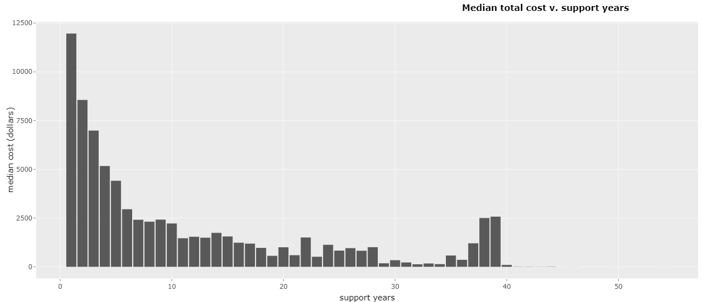
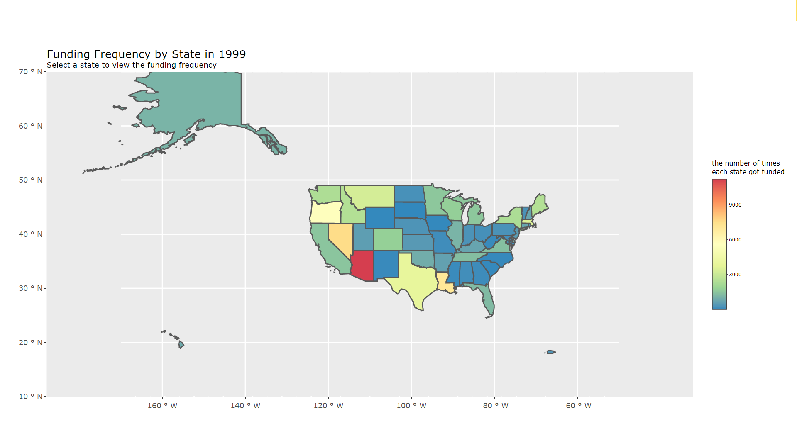

<!-- README.md is generated from README.Rmd. Please edit that file -->

```{r, include = FALSE}
knitr::opts_chunk$set(
  collapse = TRUE,
  comment = "#>",
  fig.path = "man/figures/README-",
  out.width = "100%"
)
library(researchr)
```

# researchr

<!-- badges: start -->
[](https://lifecycle.r-lib.org/articles/stages.html#experimental)
[](https://CRAN.R-project.org/package=researchr)
<!-- badges: end -->

The goal of researchr is to make finding information about funded research opportunities easier and more accessible. This package takes a year as an input and will return a dataframe of information on funded NIH research opportunities from that year. Details include PIs, location, department, and much more.  

## Installation

You can install researchr like so:

```
remotes::install_github('kbruncati/diviiproject')
```

## Getting the Data

With `nih_research`, the user can select a year between 1985 - 2021 and will receive a data frame with NIH funded research opportunities relevant to the selected year. From there, the user can make use of the other two functions, `median_total_cost` and `funding_frequency`, to take a closer look at the funding data for the selected year.

Here are the columns of the dataframe that `nih_research` returns to the user:

```{r}
colnames(nih_research(1999)) 
```

## ExPORTER Data Dictionary

If you need more information on a column in your NIH Research dataset, check out the [ExPORTER Data Dictionary](https://report.nih.gov/exporter-data-dictionary).

## Visualization Examples

With `median_total_cost`, the user gets an interactive plot posing number of support years against median total cost for a project. Median total cost refers to total project funding from all NIH Institute and Centers. You can use the function like so:

```
median_total_cost(data2)
```

Here is a sample screenshot of an interactive plot for 1999 data:

 

With `funding_frequency`, the user gets an interactive map plot of the United States that color codes based on frequency of NIH funding. The user can hover their mouse over each state for specific counts and adjust visual settings as needed. You can create one of these plots like so:

```
funding_frequency(data2)
```

Here is a sample screenshot of an interactive plot for 2001 data:



## Authors

Benjamin Bruncati and Hongtong Lin
